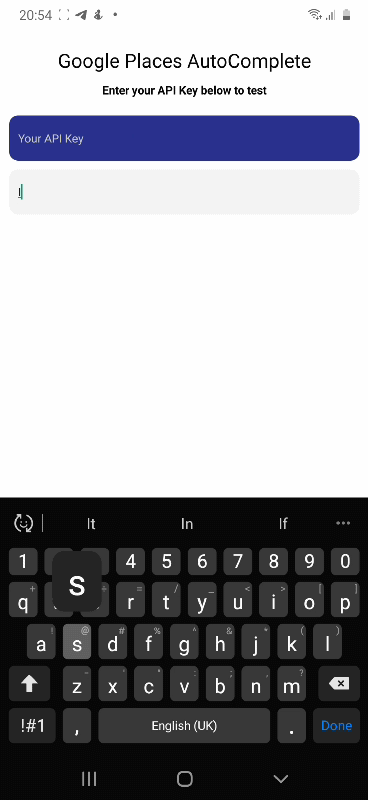

# rn-google-places-autocomplete

Easy to use Google places autocomplete with in-built support for sessionTokens.

### Screenshot


**[See demo app here](https://expo.io/@devrue/places-autocomplete-demo "rn-google-places-autocomplete")**


### Installation

**Note**: You must obtain an API Key for Places Autocomplete from your developer console. This Module uses the HTTP Places Autocomplete web service 

```bash
npm install rn-google-places-autocomplete
```
or 

```bash
yarn add rn-google-places-autocomplete
```

### Usage

```typescript
import AutoComplete from 'rn-google-places-autocomplete';
const apiKey = 'YOUR_API_KEY';

// built from the ground up to be easily customized
// includes typings for all options

<AutoComplete
  googleParameters={{
    apiKey: apiKey,
    components: ['ng']
  }}
  platformType="expo"
  placeholder="Search place"
  fetchActivity={true}
  predictionOptions={{
    icon: <Icon /> //,
    highlight: 'matched',
    style: {
      mainText: {
        color: '#5c6bc0'
      },
      boldText: {
        color: '#303f9f'
      }
    }
  }}
  onSelectAddress={(addr) => {
    // returns a prediction type
  }}
  onQueryError={(e) => {
    // do something with the return error
    // type spec below
  }}
  onFetching={(status) => {
    // true when fetch starts and false when fetch end
    // you can create a custom interaction by listing to this event
  }}
/>

```

### Features

* Supports Session Tokens
* Offers useful events that allow more customizations
* Easy to style
* Mirrors all parameter on the [google documentation here](https://developers.google.com/places/web-service/autocomplete/ "Google Places Autocomplete")


### Complete AutoComplete Options

```typescript

  platformType: "bare" | "expo" // choose expo for expo project and bare otherwise

  placeholder: string // input place holder

  value: string // set initial Value

  inputContainerStyle: ViewStyle // style the view that wraps the TextInput

  inputStyle: TextStyle // style the input box

  fetchOffset: number // number of characters to enter before starting places search

  fetchActivity: boolean | JSX.Element // set to true to show the default fetch activity or passing in your own Element

  predictionOptions: {
    style?: suggestionsStyle, // style every component in the predictions list see styling for more information
    icon?: JSX.Element, // icon to display on the left in each prediction item
    highlight?: decorateTextFormat // matched | unmatched; specifies part of text to highlight
  }

  googleParameters: GoogleParameters // all supported parameters from places autocomplete. see https://developers.google.com/places/web-service/autocomplete

  onSelectAddress: (address: prediction): void // Event | returns the selected prediction type

  onFetching: (status: boolean): void // Event | returns the selected prediction type

  onQueryError: (res: GoogleAutoCompleteResult) // Event | returns the Result from Google Places when status != 'OK'

```

### Stylings

```typescript

  AutoComplete {

    inputContainerStyle: ViewStyle // input contain style

    inputStyle: TextStyle // input style

    predictionOptions: {

      style: suggestionStyle {

        container: ViewStyle // predictions container style

        itemContainer: ViewStyle // prediction lineItem style

        mainText: TextStyle // prediction text style

        boldText: TextStyle // styling for when highlight is set

      }

    }

  }

```
### Important component types

```typescript
  // see https://developers.google.com/places/web-service/autocomplete for more 
  // information on the type of values to pass here
  GoogleParameters {
    apiKey: string;
    offset?: number;
    origin?: latlng;
    location?: latlng;
    radius?: number;
    language?: supportedLanguages;
    types?: googlePlacesType,
    components?: Array<iso3166>;
    strictbounds?: boolean;
  }

  // see https://developers.google.com/places/web-service/autocomplete#place_autocomplete_responses
  // for more information on the type of response that'll be populated here
  GoogleAutoCompleteResult{
    error_message: string;
    predictions: Array<prediction>;
    status: string;
  }

  // represents each item in the predictions fromplaces autocomplete
  prediction {
    description: string;
    distance_meters?: number;
    id: string;
    matched_substrings: Array<lengthAndOffset>;
    place_id: string;
    reference: string;
    structured_formatting?: structured_formatting;
    terms: Array<offsetAndValue>
    types: Array<string>
  }

```


### Contributing
Pull requests are welcome. For major changes, please open an issue first to discuss what you would like to change.

### License
[MIT](https://choosealicense.com/licenses/mit/)
